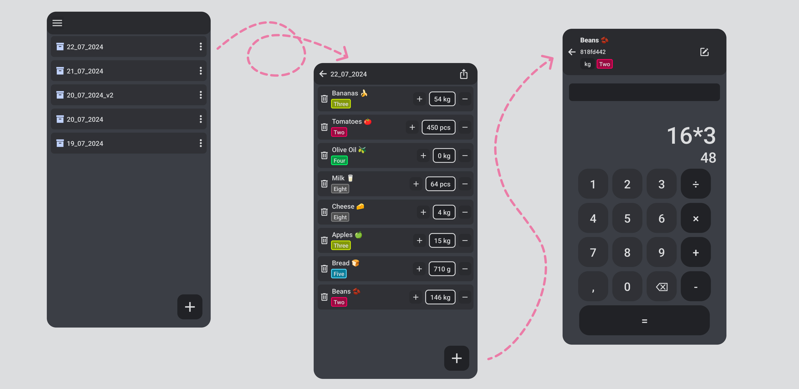

# Inventory

##### Description:

Optimize your inventory management with the Inventory App! This user-friendly app is designed to make it easier for you to inventory and manage your stock. Whether you run a small business or a large enterprise, our app provides you with the tools you need to keep track of your inventory at all times.

Main features:

- Easy inventory: Use the app's built-in calculator to ensure the fastest possible entry of your items.

##### Download:

[Google Play Store](https://play.google.com/store/apps/details?id=com.heitzlki.inventory)

##### Features:

- [x] Create Inventories
- [x] Export Inventories (excel)
- [x] Create Products
- [x] Calculate Amount
- [x] Add Categories

##### Screenshots:

##### Contact:

heitzlki.dev@gmail.com
